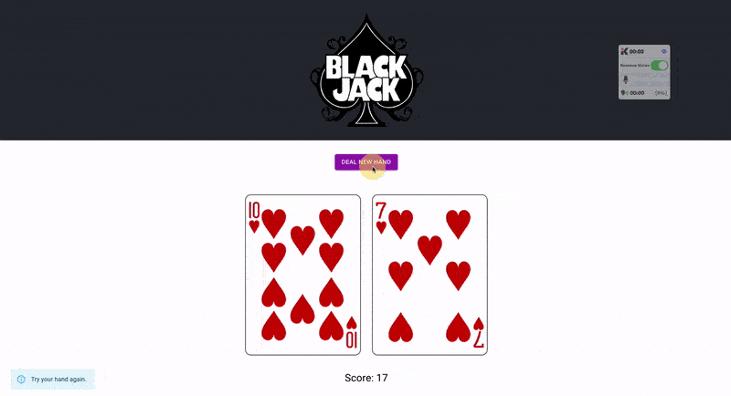

# Blackjack Two-Hand Draw App

This is a React app built with Vite that draws two cards from a deck, then tabulates a summed score to see if the hand reaches ***Blackjack!***



### API
This app uses the [Deck of Cards API](https://deckofcardsapi.com/) to draw the cards.

### Installation and Setup
To install this app, run:
```shell
npm install
npm run dev
```

This will install all necessary packages and run the app on `localhost:3000`